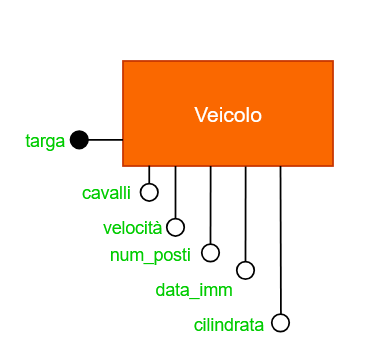

# UNIVERSITÀ DEGLI STUDI DI UDINE
## Dipartimento di Scienze Matematiche, Informatiche e Fisiche


# Relazione Progetto Basi di Dati
## Indice degli argomenti
1. [Progettazione Concettuale](#progettazione-concettuale)
2. [Progettazione Logica](#progettazione-logica)
3. [Progettazione Fisica](#progettazione-fisica)
4. [Implementazione](#implementazione)
5. [Analisi con R](#analisi-con-r)
6. [Conclusioni](#conclusioni)
# Progettazione Concettuale

## Progetto "Registro Automobilistico"
 Si progetti uno schema entità/relazioni per la gestione di un registro automobilistico, facente parte del sistema informativo di un ufficio di motorizzazione, contenente le seguenti informazioni:
- di ciascun veicolo interessa registrare la targa, la cilindrata, i cavalli fiscali, la velocità, il numero di posti e la data di immatricolazione;
- i veicoli sono classificati in categorie (automobili, ciclomotori, camion, rimorchi, ecc.);
- ciascun veicolo appartiene ad uno specifico modello;
- tra i dati relativi ai veicoli, vi è la codifica del tipo di combustibile utilizzato;
- di ciascun modello di veicolo è registrata la fabbrica di produzione e il numero delle versioni prodotte;
- ciascun veicolo può avere uno o più proprietari, che si succedono nel corso della “vita” del veicolo; di ciascun proprietario interessa registrare cognome, nome e indirizzo di residenza.<br>

Lo schema entità/relazioni dovrà essere completato con attributi "ragionevoli" per ciascuna entità, identificando le possibili chiavi e le relazioni necessarie per la gestione del sistema in esame.
A partire dallo schema entità/relazioni, si costruisca il corrispondente schema relazionale.<br>

### GLOSSARIO Termini
| Termine | Descrione | Sinonimi | Link |
| --- | --- | --- | --- |
| Veicolo| informazioni generali su un veicolo| | Modello, Proprietario, Combustibile|
| Modello| Tipo di modello di veicolo| | Veicolo, Fabbrica|
| Fabbrica| Azienda che procude un modello di veicolo| | Modello|
| Proprietario| Chi ha posseduto e possiede un veicolo| | Veicolo|
| Combustibile| Quale combustibile utilizza un veicolo| | Veicolo|
### Frasi
  **Frasi generiche** :
> Si progetti uno schema entità/relazioni per la gestione di un registro automobilistico, facente parte del sistema informativo di un ufficio di motorizzazione, contenente le seguenti informazioni

**Frasi relative al veicolo**:
> di ciascun veicolo interessa registrare la targa, la cilindrata, i cavalli fiscali, la velocità, il numero di posti e la data di immatricolazione

**Frasi relative al modello**:
> ciascun veicolo appartiene ad uno specifico modello

**Frasi relative alla fabbrica**:
> di ciascun modello di veicolo è registrata la fabbrica di produzione e il numero delle versioni prodotte

**Frasi relative al proprietario**:
> ciascun veicolo possono avere uno o piú proprietari, che si succedono nel corso della “vita” del veicolo; di ciascun proprietario interessa registrare cognome, nome e indirizzo di residenza

**Frasi relative al combustibile**:
> di ciascun veicolo interessa registrare il tipo di combustibile utilizzato

## Modello ER
La strategia che abbiamo utilizzato per costruire il modello ER è la strategia Mista (Mixed Strategy). Abbiamo optato per questa tecnica perché ci sembrava comodo avere uno scheletro iniziale che ci permettesse di avere una visione di base dello schema. Inizialmente abbiamo usato la strategia bottom-up per assemblare insieme tutte le entità. In seguito, abbiamo usato la tecnica top-down, in questo modo, tramite perfezionamenti, abbiamo sviluppato lo schema finale.

La prima entità che abbiamo esaminato è **Veicolo**. Gli attributi che abbiamo aggiunto a questa entità sono targa, cilindrata, cavalli fiscali, velocità, numero di posti e data immatricolazione. Questa entità viene identificata univocamente dall’attributo targa.



In seguito per quanto riguarda Veicolo abbiamo deciso di fare una **generalizzazione** **Totale** e **Disgunta**. In questo modo un veicolo puo` essere distinto tra Automobili, Ciclomotori, Camion e Rimorchio. La generalizzazione e' totale perche' veicolo puo' ricoprire solo una delle quattro categorie. La generalizzazione e' disunta perche' veicolo puo' ricoprire solo una delle quattro categorie.


L'entita' successiva che abbiamo analizzato e' **Modello**. Gli attributi che abbiamo aggiunto a questa entita' sono idModello, nome modello e numero versioni. Questa entita' viene identificata univocamente dall'attributo idModello.


# Strutturazione dei requisiti

## Entità principali e vincoli

Veicolo:

* Targa (PK): non può essere NULL, univoco   
* Cilindrata: può essere NULL solo nel caso di un rimorchio  
* Cavalli fiscali: può essere NULL solo nel caso di un rimorchio  
* Numero posti: può essere NULL solo nel caso di un rimorchio  
* Data immatricolazione: non può essere NULL

Modello:

* IdModello (PK): non può essere NULL, univoco  
* Nome modello  
* Numero versioni: se presente maggiore di 0

Fabbrica: 

* IdFabbrica (PK): non può essere NULL, univoco  
* Nome

Combustibile:

* Codice Combustibile (PK):  non può essere NULL, univoco  
* Tipo

Proprietario:

* IdProprietario: non può essere NULL, univoco   
* Indirizzo: Va inserito l’intero indirizzo in una stringa

## Generalizzazioni: 

Veicolo (Entità genitore):

* Automobile (Entità figlia)  
  * tipologia  
* Camion (Entità figlia)  
  * numero assi  
* Ciclomotore (Entità figlia)  
  * bauletto  
* Rimorchio (Entità figlia)  
  * tipologia  
  * carico  
    

Proprietario (Entità genitore):

* Privato  (Entità figlia)  
  * CF: not NULL  
  * nome  
  * cognome  
  * data di nascita  
* Societa (Entità figlia)  
  * partita iva  
  * nome

## Relazioni principali e vincoli:

Appartiene \-\> Tra Veicolo (1:1) e Modello (1:N)

* Un veicolo può appartenere solo ad un modello.  
* Più veicoli possono essere dello stesso modello.  
* Per ogni modello deve esserci almeno un veicolo che appartiene a quel modello per essere presente nel database

Prodotto \-\> Tra Modello (1:1) e Fabbrica (1:N)

* Un modello deve essere prodotto da una sola fabbrica.  
* Una fabbrica può produrre più modelli.


Utilizza \-\> Tra Veicolo (1:1) e Combustibile (1:N)

* Un veicolo può utilizzare solo ad un tipo di combustione.  
* Più veicoli possono utilizzare lo stesso tipo di combustione.  
* Un tipo di combustione deve essere utilizzato da almeno un veicolo per poter essere presente nel database

Possiede \-\> Tra Veicolo (1:1) e Proprietario (0:N)

* Attributi:  
  * data di acquisto  
* Un veicolo può essere posseduto da un solo Proprietario.  
* Un proprietario può non possedere o possedere uno o più veicoli.

## Relazioni critiche e vincoli:

Possedeva \-\> Tra Veicolo (0:N) e Proprietario (0:N)

* Attributi:  
  * data acquisto  
  * data vendita  
* Un veicolo può non avere o avere uno o più proprietari passati  
* Un proprietario può non avere avuto o avere avuto uno o più veicolo nel passato   
* Se un proprietario compra e vende la stessa macchina due volte allora si registrano solo le date dell’ultima occorrenza.
## Regole di Gestione
- Gli attributi data_acquisto e data_vendita nella relazione PROPRIETARI PASSATI non devono combaciare, non devono intersecarsi tra intervalli di proprietari diversi e data_acquisto non deve essere NULL

# Operazioni richeste
- **Op1**: Aggiunta nuovo veicolo prodotto [15 al giorno]
- **Op2**: Calcolare tutti i dati relativi alla fabbrica soprattutto il numero dei veicoli prodotti [2 al giorno]
## Progettazione Logica
### Tabella volumi
| Concetto               | Tipo  | Volume   |
|---                     | ---   | ---      |
| Veicolo                | E     | 90000    |
| Proprietario           | E     | 125000   |
| Combustibile           | E     | 5        |
| Modello                | E     | 200      |
| Fabbrica               | E     | 10       |
| ProprietarioCorrente   | R     | 90000    |
| ProprietariPassati     | R     | 225000   |
| Appartiene             | R     | 90000    |
| Prodotto               | R     | 200      |
| Utilizza               | R     | 90000    |

*In media una persona possiede 0.75 veicoli*
*In media un veicolo ha avuto 2.5 proprietari nel passato*

### Analisi delle ridondanze
Si prende in considerazione la prima operazione. In un giorno vengono registrati 15 veicoli.

Mentre la seconda operazione ovvero, la visualizzazione dei dati della fabbrica viene eseguita due volte al giorno sia all'apertura che alla chiusura del portale.

#### Presenza di ridondanza
- Aggiundere (fare) mini schema ER


Per eseguire il calcolo delle operazione in presenza di ridondanze si fa il calcolo di ogni micro processo:

+ Operazione 1: 
  + Memorizzo il nuovo veicolo 
  + memorizzo la coppia veicolo-modello 
  + cerco il modello e per risalire alla fabbrica
  + cerca la fabbrica di interesse
  + incremento di uno i veicoli prodotti

|Concetto     |Costrutto|Accessi|Tipo|
|--------     |---------|-------|----|
|Veicolo      | E       |1      |S   |
|Appartiene   |R        |1      |S   |
|Modello      |E        |0      |    |
|Prodotto     |R        |1      |L   |
|Fabbrica     |E        |1      |L   |
|Fabbrica     |E        |1      |S   |

```math
(15*3)*2 + (15*2) = 120
```
+ Operazione 2:
  + Leggere gli attributi della fabbrica

|Concetto     |Costrutto|Accessi|Tipo|
|--------     |---------|-------|----|
|Fabbrica     |E        |1      |L   |

```math
2*1 = 2
```

#### Assenza di ridondanza
- Aggiundere (fare) mini schema ER

- Operazioen 1:
  - Memorizzo il nuovo veicolo
  - Memorizzo la coppia veicolo modello

|Concetto     |Costrutto|Accessi|Tipo|
|--------     |---------|-------|----|
|Veicolo      |E        |1      |S   |
|Appartiene   |R        |1      |S   |
|Modello      |E        |0      |    |
|Prodotto     |R        |0      |    |
|Fabbrica     |E        |0      |    |


$(15 * 2) * 2 = 60$

- Operazione 2: Per calcolare il numero di veicoli prodotti da una fabbrica dobbiamo accedere alla relazione "prodotto" un n di volte pare al numero medio di veicoli prodotti da una certa fabbrica (dalla fabbrica): nrModelli/nrFabbriche (200/10) **e per ogni di questi modelli** bisogna accedere un nr di volte pari al numero medio di veicoli appertenenti ad un modello : nrVeicoli /nrModelli (90000/200)

|Concetto     |Costrutto|Accessi|Tipo|
|--------     |---------|-------|----|
|Fabbrica     |E        |1      |L   | 
|Prodotto     |E        |20     |L   |
|Appartiene   |E        |9000 (20*450)   |L   | 

$1+20+9000 = 9021$

### Costi operazione
Presenza di ridondanza &Longrightarrow; $120+2=122$

Assenza di ridondanza &Longrightarrow; $60 + 9021 = 9081$

Quindi ci conviene tenere il dato ridondante. 

#### Eliminazione delle generalizzazioni
In questa fase del progetto sono state gestite le generalizzazioni presenti eliminando le gerarchie, in particolare sono state trasformate le seguenti parti:
**Veicolo**


**Proprietario**


#### Partizionamento o accorpamento
Sono stati eliminati gli attributi non atomici, nel nostro caso l'attributo indirizzo dell'entita *propritario*. Noi abbiamo gia partizionato le nostre entita e relazioni durante la progettazione dello schema ER **(chiedere al prof)** 
### Selezione degli identificatori

| Entita`     |  Chiavi          | 
|-------------|-------------------|
| Veicolo     | Targa             | 
| Combustibile| codiceCombustibile | 
| Proprietario| CodiceFiscale      | 
| Modello     | idModello         | 
| Fabbrica    | idFabbrica       | 

### Traduzione modello logico
+ Fabbrica(_idFabbrica_,nome,numeroVeicoloProdotti)
+ Modello(_idModello_,nomeModello,numeroVersioni,**_FabbricaDiProduzione_**)
+ Combustibile(_codiceCombustibile_,tipoCombustibile)
+ Proprietario(_codiceFiscale_,nome,cognome,indirizzo)
+ Privato(_**CodiceFiscale**_,dataNascita)
+ Societa(_**CodiceFiscale**_,partitaIva)
+ Veicolo(_Targa_,cavalli,velocita,numeroPosti,dataImmatricolazione, cilindrata, _**Modello**_,_**CodiceCombustibile**_,_**Proprietario**_)
+ ProprietariPassati(**_Targa,CodiceFiscale_**,dataVendita,dataAcquisto)
+ Automobile(_**Targa**_,tipologia)
+ Ciclomotore(_**Targa**_,bauletto)
+ Camion(_**Targa**_,numeroAssi)
+ Rimorchio(_**Targa**_,tipologia,carico)
  
*FK: FabbricaDiProduzione &rarr; Fabbrica(idFabbrica)*
*FK: CodiceFiscale &rarr; Proprietario(codiceFiscale)*
*FK: Modello &rarr; Fabbrica(idFabbrica)*
*FK: CodiceCombustibile &rarr; Fabbrica(idFabbrica)*
*FK: Proprietario &rarr; Fabbrica(idFabbrica)*
*FK: Targa &rarr; Fabbrica(idFabbrica)*

## Progettazione Fisica
### Definizione database in SQL
#### Definizione dati
#### Creazione tabelle
#### Definizione trigger
### Popolazione base di dati
### Query
  ### Query nostre
  1. Trovare tutti i veicoli che hanno uno o più proprietari.
  2. Il veicolo con il maggior numero di cavalli che ha avuto 1 e un solo proprietario.
  3. Le societ&agrave; che è un proprietario passato di esattamente 2 veicoli
  ### Query obbligatorie
  1. Tutti i veicoli prodotti da fabbriche che hanno prodotto esattamente 3 modelli.
  ```sql
  SELECT 
  FROM
  WHERE
  ```
  2. Tutti i veicoli in cui il proprietario corrente è anche un proprietario passato
  ```sql
  SELECT
  FROM
  WHERE
  ```
  3. La fabbrica con il massimo numero di veicoli elettrici.
  ```sql
  CREATE VIEW maxElet(targa,codiceCombustibile,nVeicoli) AS (  
    SELECT v1.targa,v1.codiceCombustibile,count(*)
    FROM veicolo AS V1
    GROUP BY V1.codiceCombustibile
    )
  
  SELECT targa
  FROM maxElet AS ME
  WHERE ME.codiceCombustibile = "Elettrico" AND
  ME.nVeicoli >= ALL(
    SELECT ME1.nVeicoli
    FROM maxElet
    )
  ```
## Analisi con R
## Conclusioni


