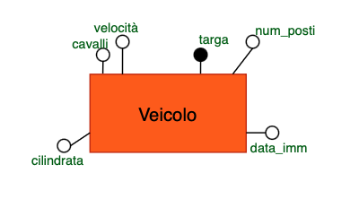

# UNIVERSITÀ DEGLI STUDI DI UDINE
## Dipartimento di Scienze Matematiche, Informatiche e Fisiche


# Relazione Progetto Basi di Dati
## Indice degli argomenti
1. [Progettazione Concettuale](#progettazione-concettuale)
2. [Progettazione Logica](#progettazione-logica)
3. [Progettazione Fisica](#progettazione-fisica)
4. [Implementazione](#implementazione)
5. [Analisi con R](#analisi-con-r)
6. [Conclusioni](#conclusioni)
# Progettazione Concettuale

## Progetto "Registro Automobilistico"
 Si progetti uno schema entità/relazioni per la gestione di un registro automobilistico, facente parte del sistema informativo di un ufficio di motorizzazione, contenente le seguenti informazioni:
- di ciascun veicolo interessa registrare la targa, la cilindrata, i cavalli fiscali, la velocità, il numero di posti e la data di immatricolazione;
- i veicoli sono classificati in categorie (automobili, ciclomotori, camion, rimorchi, ecc.);
- ciascun veicolo appartiene ad uno specifico modello;
- tra i dati relativi ai veicoli, vi è la codifica del tipo di combustibile utilizzato;
- di ciascun modello di veicolo è registrata la fabbrica di produzione e il numero delle versioni prodotte;
- ciascun veicolo può avere uno o più proprietari, che si succedono nel corso della “vita” del veicolo; di ciascun proprietario interessa registrare cognome, nome e indirizzo di residenza.<br>

Lo schema entità/relazioni dovrà essere completato con attributi "ragionevoli" per ciascuna entità, identificando le possibili chiavi e le relazioni necessarie per la gestione del sistema in esame.
A partire dallo schema entità/relazioni, si costruisca il corrispondente schema relazionale.<br>

### GLOSSARIO Termini
| Termine | Descrione | Sinonimi | Link |
| --- | --- | --- | --- |
| Veicolo| informazioni generali su un veicolo| | Modello, Proprietario, Combustibile|
| Modello| Tipo di modello di veicolo| | Veicolo, Fabbrica|
| Fabbrica| Azienda che procude un modello di veicolo| | Modello|
| Proprietario| Chi ha posseduto e possiede un veicolo| | Veicolo|
| Combustibile| Quale combustibile utilizza un veicolo| | Veicolo|
### Frasi
  **Frasi generiche** :
> Si progetti uno schema entità/relazioni per la gestione di un registro automobilistico, facente parte del sistema informativo di un ufficio di motorizzazione, contenente le seguenti informazioni

**Frasi relative al veicolo**:
> di ciascun veicolo interessa registrare la targa, la cilindrata, i cavalli fiscali, la velocità, il numero di posti e la data di immatricolazione

**Frasi relative al modello**:
> ciascun veicolo appartiene ad uno specifico modello

**Frasi relative alla fabbrica**:
> di ciascun modello di veicolo è registrata la fabbrica di produzione e il numero delle versioni prodotte

**Frasi relative al proprietario**:
> ciascun veicolo possono avere uno o piú proprietari, che si succedono nel corso della “vita” del veicolo; di ciascun proprietario interessa registrare cognome, nome e indirizzo di residenza

**Frasi relative al combustibile**:
> di ciascun veicolo interessa registrare il tipo di combustibile utilizzato

## Modello ER
La strategia che abbiamo utilizzato per costruire il modello ER è la strategia Mista (Mixed Strategy). Abbiamo optato per questa tecnica perché ci sembrava comodo avere uno scheletro iniziale che ci permettesse di avere una visione di base dello schema. Inizialmente abbiamo usato la strategia bottom-up per assemblare insieme tutte le entità. In seguito, abbiamo usato la tecnica top-down, in questo modo, tramite perfezionamenti, abbiamo sviluppato lo schema finale.

La prima entità che abbiamo esaminato è **Veicolo**. Gli attributi che abbiamo aggiunto a questa entità sono targa, cilindrata, cavalli fiscali, velocità, numero di posti e data immatricolazione. Questa entità viene identificata univocamente dall’attributo targa.



In seguito per quanto riguarda Veicolo abbiamo deciso di fare una **generalizzazione** **Totale** e **Disgunta**. In questo modo un veicolo puo` essere distinto tra Automobili, Ciclomotori, Camion e Rimorchio. La generalizzazione e' totale perche' veicolo puo' ricoprire solo una delle quattro categorie. La generalizzazione e' disunta perche' veicolo puo' ricoprire solo una delle quattro categorie.


L'entita' successiva che abbiamo analizzato e' **Modello**. Gli attributi che abbiamo aggiunto a questa entita' sono idModello, nome modello e numero versioni. Questa entita' viene identificata univocamente dall'attributo idModello.


# Strutturazione dei requisiti

## Entità principali e vincoli

Veicolo:

* Targa (PK): non può essere NULL, univoco   
* Cilindrata: sarà 0 nel caso di un rimorchio  
* Cavalli fiscali: sarà 0 nel caso di un rimorchio  
* Velocita': sarà 0 nel caso di un rimorchio  
* Numero posti: sarà 0 nel caso di un rimorchio 
* Data immatricolazione: non può essere NULL

Modello:

* IdModello (PK): non può essere NULL, univoco  
* Nome modello  
* Numero versioni: non può essere NULL, maggiore di 0

Fabbrica: 

* IdFabbrica (PK): non può essere NULL, univoco  
* Nome

Combustibile:

* Codice Combustibile (PK):  non può essere NULL, univoco  
* Tipo

Proprietario:

* IdProprietario: non può essere NULL, univoco   
* Indirizzo:  non può essere NULL, Va inserito l’intero indirizzo in una stringa

## Generalizzazioni: 

Veicolo (Entità genitore):

* Automobile (Entità figlia)  
  * tipologia  
* Camion (Entità figlia)  
  * numero assi  
* Ciclomotore (Entità figlia)  
  * bauletto  
* Rimorchio (Entità figlia)  
  * tipologia  
  * carico  
    

Proprietario (Entità genitore):

* Privato  (Entità figlia)  
  * CF: not NULL  
  * nome  not NULL
  * cognome  not NULL
  * data di nascita  
* Societa (Entità figlia)  
  * partita iva  
  * nome

## Relazioni principali e vincoli:

Appartiene &rarr; Tra Veicolo (1:1) e Modello (1:N)

* Un veicolo può appartenere solo ad un modello.  
* Più veicoli possono essere dello stesso modello.  
* Per ogni modello deve esserci almeno un veicolo che appartiene a quel modello per essere presente nel database

Prodotto &rarr; Tra Modello (1:1) e Fabbrica (1:N)

* Un modello deve essere prodotto da una sola fabbrica.  
* Una fabbrica può produrre più modelli.


Utilizza &rarr; Tra Veicolo (1:1) e Combustibile (1:N)

* Un veicolo può utilizzare solo ad un tipo di combustione.  
* Più veicoli possono utilizzare lo stesso tipo di combustione.  
* Un tipo di combustione deve essere utilizzato da almeno un veicolo per poter essere presente nel database

ProprietaroCorrente &rarr; Tra Veicolo (1:1) e Proprietario (0:N)

* Attributi:  
  * data di acquisto  
* Un veicolo può essere posseduto da un solo Proprietario.  
* Un proprietario può non possedere o possedere uno o più veicoli.

## Relazioni critiche e vincoli:

ProprietariPassati \-\> Tra Veicolo (0:N) e Proprietario (0:N)

* Attributi:  
  * data acquisto  
  * data vendita  
* Un veicolo può non avere o avere uno o più proprietari passati  
* Un proprietario può non avere avuto o avere avuto uno o più veicolo nel passato   
* Se un proprietario compra e vende la stessa macchina due volte allora si registrano solo le date dell’ultima occorrenza.
## Regole di Gestione
- Gli attributi data_acquisto e data_vendita nella relazione PROPRIETARI PASSATI non devono combaciare, non devono intersecarsi tra intervalli di proprietari diversi e data_acquisto non deve essere NULL

## Operazioni richeste
- **Op1**: Aggiunta nuovo veicolo prodotto [15 al giorno]
- **Op2**: Calcolare tutti i dati relativi alla fabbrica soprattutto il numero dei veicoli prodotti [2 al giorno]

# Progettazione Logica
### Tabella volumi
| Concetto               | Tipo  | Volume   |
|---                     | ---   | ---      |
| Veicolo                | E     | 90000    |
| Proprietario           | E     | 125000   |
| Combustibile           | E     | 5        |
| Modello                | E     | 200      |
| Fabbrica               | E     | 10       |
| ProprietarioCorrente   | R     | 90000    |
| ProprietariPassati     | R     | 225000   |
| Appartiene             | R     | 90000    |
| Prodotto               | R     | 200      |
| Utilizza               | R     | 90000    |

Questa tabella ci fornisce una visione chiara della dimensione del sistema che stiamo progettando. Notiamo che:


* Il rapporto tra veicoli e proprietari è di circa 0.75, indicando che in media una persona possiede meno di un veicolo.  
* Ogni veicolo ha avuto in media 2.5 proprietari nel passato, suggerendo un'alta frequenza di cambi di proprietà.


### Analisi delle ridondanze
**Caso studio: Numero di veicoli prodotti per Fabbrica**

#### Presenza di ridondanza

Consideriamo l'attributo "numeroVeicoliProdotti" nell'entità Fabbrica. Questo è un dato derivabile ma potrebbe essere utile mantenerlo come ridondanza per migliorare le prestazioni.


Per eseguire il calcolo delle operazione in presenza di ridondanze si fa il calcolo di ogni micro processo:

+ OP1: Aggiunta nuovo veicolo (15 volte al giorno):
  + Memorizzo il nuovo veicolo 
  + memorizzo la coppia veicolo-modello 
  + cerco il modello e per risalire alla fabbrica
  + cerca la fabbrica di interesse
  + incremento di uno i veicoli prodotti

|Concetto     |Costrutto|Accessi|Tipo|
|--------     |---------|-------|----|
|Veicolo      | E       |1      |S   |
|Appartiene   |R        |1      |S   |
|Modello      |E        |0      |    |
|Prodotto     |R        |1      |L   |
|Fabbrica     |E        |1      |L   |
|Fabbrica     |E        |1      |S   |


 $(15*3)*2 + (15*2) = 120$

 Totale: 3 scritture \+ 2 letture \= 8 accessi/operazione  
  Costo giornaliero: 8 \* 15 \= 120 accessi


+ OP2: Visualizzazione dati Fabbrica (2 volte al giorno):
  + Leggere gli attributi della fabbrica

|Concetto     |Costrutto|Accessi|Tipo|
|--------     |---------|-------|----|
|Fabbrica     |E        |1      |L   |

 $2*1 = 2$

 Costo giornaliero: 1 \* 2 \= 2 accessi


**Costo totale giornaliero con ridondanza: 122 accessi**


### Assenza di ridondanza


- OP1: Aggiunta nuovo veicolo (15 volte al giorno):
  - Memorizzo il nuovo veicolo
  - Memorizzo la coppia veicolo modello

|Concetto     |Costrutto|Accessi|Tipo|
|--------     |---------|-------|----|
|Veicolo      |E        |1      |S   |
|Appartiene   |R        |1      |S   |
|Modello      |E        |0      |    |
|Prodotto     |R        |0      |    |
|Fabbrica     |E        |0      |    |

 $(15 * 2) * 2 = 60$

Totale: 2 scritture \= 4 accessi/operazione  
  Costo giornaliero: 4 \* 15 \= 60 accessi


- OP2: Visualizzazione dati Fabbrica (2 volte al giorno): 
  - Per calcolare il numero di veicoli prodotti da una fabbrica dobbiamo accedere alla relazione "prodotto" un n di volte pare al numero medio di veicoli prodotti da una certa fabbrica (dalla fabbrica): nrModelli/nrFabbriche (200/10) **e per ogni di questi modelli** bisogna accedere un nr di volte pari al numero medio di veicoli appertenenti ad un modello : nrVeicoli /nrModelli (90000/200)

|Concetto     |Costrutto|Accessi|Tipo|
|--------     |---------|-------|----|
|Fabbrica     |E        |1      |L   | 
|Prodotto     |E        |20     |L   |
|Appartiene   |E        |9000 (20*450)   |L   | 

 $(1+20+9000)*2 = 18042$

 Costo per operazione: 1 \+ 20 \+ 9000 \= 9021 letture  
 Costo giornaliero: 9021 \* 2 \= 18042 accessi

 **Costo totale giornaliero senza ridondanza: 60 \+ 18042 \= 18102 accessi**

### Costi operazione
Presenza di ridondanza &Longrightarrow; $120+2=122$

Assenza di ridondanza &Longrightarrow; $60 + 18042 = 18102$

### **Conclusione dell'analisi**

Mantenere la ridondanza comporta un costo giornaliero di 122 accessi, mentre eliminarla porta a 18102 accessi.  
La differenza è significativa: mantenere la ridondanza riduce il carico di lavoro di circa il 99.3%. Pertanto, è altamente consigliabile mantenere l'attributo ridondante "numeroVeicoliProdotti" nell'entità Fabbrica.


### **Eliminazione delle generalizzazioni**
In questa fase del progetto sono state gestite le generalizzazioni presenti eliminando le gerarchie. In particolare sono state trasformate le seguenti parti:

**Veicolo**


Abbiamo optato per una strategia di accorpamento nel genitore. Questa scelta è motivata dal fatto che la maggior parte delle operazioni coinvolgerà attributi comuni a tutti i tipi di veicolo. 

**Proprietario**


Anche per proprietario abbiamo scelto la stessa strategia.

### **Partizionamento o accorpamento**

Per quanto riguarda l'entità Proprietario, abbiamo optato per mantenere l'attributo 'indirizzo' come un campo di testo unico, invece di partizionarlo verticalmente in componenti separate (come via, numero civico, CAP, città). Questa decisione è stata presa considerando che l'indirizzo viene generalmente utilizzato come un'unica unità informativa nelle operazioni più frequenti, e la sua scomposizione non offrirebbe vantaggi significativi in termini di prestazioni o funzionalità per il nostro specifico caso d'uso.

### **Selezione degli identificatori**

| Entita`     |  Chiavi          | 
|-------------|-------------------|
| Veicolo     | Targa             | 
| Combustibile| codiceCombustibile | 
| Proprietario| IdProprietario      | 
| Modello     | idModello         | 
| Fabbrica    | idFabbrica       | 

La scelta degli identificatori è stata fatta considerando l'unicità, l'immutabilità e la semplicità di gestione.

### Traduzione modello logico


+ Fabbrica  {**_idFabbrica_** (PK), nome, numeroVeicoloProdotti}

+ Modello {**_idModello_** (PK), nomeModello, numeroVersioni, **_FabbricaDiProduzione_** (FK → Fabbrica._idFabbrica_)}

+ Combustibile {**_codiceCombustibile_** (PK), tipoCombustibile}

+ Proprietario {**_IdProprietario_** (PK), indirizzo}

+ Privato {**_IdProprietario_** (PK, FK → Proprietario._IdProprietario_), CF, nome, cognome, dataNascita}

+ Società {**_IdProprietario_** (PK, FK → Proprietario._IdProprietario_), partitaIva}

+ Veicolo {**_Targa_** (PK), cavalli, velocità, numeroPosti, dataImmatricolazione, cilindrata, **_Modello_** (FK → Modello), **_CodiceCombustibile_** (FK → Combustibile._codiceCombustibile_), **_Proprietario_** (FK → Proprietario._IdProprietario_)}

+ ProprietariPassati {**_Targa_** (PK, FK → Veicolo._Targa_), **_IdProprietario_** (PK, FK → Proprietario._IdProprietario_), dataVendita, dataAcquisto}

+ Automobile {**_Targa_** (PK, FK → Veicolo._Targa_), tipologia}

+ Ciclomotore {**_Targa_** (PK, FK → Veicolo._Targa_), bauletto}

+ Camion {**_Targa_** (PK, FK → Veicolo._Targa_), numeroAssi}

+ Rimorchio {**_Targa_** (PK, FK → Veicolo._Targa_), tipologia, carico}

***IMPOETANTE:** Le chiavi primarie (PK) e le chiavi esterne (FK) non possono essere NULL


## Riepilogo Vincoli di integrita

### Vincoli di Chiave

**Chiavi Primarie (PK): Devono essere not null e univoche
- Veicolo.Targa
- Modello.idModello
- Fabbrica.idFabbrica
- Combustibile.codiceCombustibile
- Proprietario.IdProprietario

**Chiavi Esterne (FK): 
- Veicolo.Modello → Modello.idModello
- Veicolo.CodiceCombustibile → Combustibile.codiceCombustibile
- Veicolo.Proprietario → Proprietario.IdProprietario
- Modello.FabbricaDiProduzione → Fabbrica.idFabbrica
- ProprietariPassati.Targa → Veicolo.Targa
- ProprietariPassati.IdProprietario → Proprietario.IdProprietario


### Vincoli di Entità

(Questi dati sono importanti e devono essere presenti)
- Veicolo.dataImmatricolazione NOT NULL
- Veicolo.Cilindrata: NOT NULL  
- Veicolo.Cavalli: NOT NULL  
- Veicolo.Velocita': NOT NULL  
- Veicolo.NumeroPosti: NOT NULL
- Modello.numeroVersioni: NOT NULL
- Proprietario.indirizzo: NOT NULL
- Privato.CF NOT NULL
- Privato.nome NOT NULL
- Privato.cognome NOT NULL
- Società.partitaIva NOT NULL


### Vincoli di Dominio

- Modello.numeroVersioni > 0
- Veicolo.cilindrata > 0 (se Rimorchio allora 0)
- Veicolo.cavalli > 0 (se Rimorchio allora 0)
- Veicolo.numeroPosti > 0 (se Rimorchio allora 0)
- Veicolo.velocita' > 0 (se Rimorchio allora 0)


### Vincoli di partecipazione 

+ Affinche' una fabbrica sia presente nel database deve comparire almeno in uno dei modelli presenti
+ Affinche' un modello sia presente nel database deve comparire almeno in uno dei veicoli presenti
+ Affinche un tipo di combustione sia presente nel database deve comparire almeno in uno dei veicoli presenti
+ Un veicolo deve per forza avere un proprietario corrente (uno solo)
+ Un proprietario puo non avere un veicolo al momento


### Vincoli di Generalizzazione
 Totalità e disgiunzione
- Ogni proprietario deve essere solo Privato o Società
- Ogni veicolo deve comparire in esattamente una tabella figlia: (Automobile, Camion, Ciclomotore, Rimorchio)


### Vincoli di Integrità Referenziale

- Non posso cancellare nessun oggetto(record) se viene puntato da una chiave esterna
  - esempio: non posso cancellare un proprietario se lui possiede una veicolo che si trova nel database
  - altro esempio: non posso cancellare una fabbrica se esiste un modello che e' stato prodotto da quella fabbrica


### Vincoli di Tupla

- ProprietariPassati: CHECK (dataVendita > dataAcquisto)
- ProprietariPassati: UNIQUE (Targa, IdProprietario)
  - se un proprietario compra e vende piu' di una volta lo stesso veicolo si registra salva solo l'ultima occorrenza 

### Vincoli Inter-tabella ( Ridondanza Controllata) 

- Trigger per aggiornare Fabbrica.numeroVeicoliProdotti quando viene inserito un nuovo veicolo


## Progettazione Fisica
### Definizione database in SQL
#### Definizione dati
#### Creazione tabelle
#### Definizione trigger
### Popolazione base di dati
### Query
  ### Query nostre
  1. I veicoli con almeno 1 proprietario
  ```sql
  SELECT v.targa
  FROM veicolo as v
  WHERE not exists(
    SELECT *
    FROM veicolo as v1
    WHERE v1.targa <> v.targa and
    v1.proprietario = v.proprietario
    )
  ```
  2. Il veicolo con il maggior numero di cavalli che ha avuto 1 e un solo proprietario.
  ```sql
  create view maxCavalli(targa,nCavalli) as
    select v.targa,count(*)
    from veicolo as v
    group by v.cavalli

    select mc.targa
    from veicolo as v1, maxCavalli as mc
    where v1.propritario proprietario mc.nCavalli >= ALL (
      select mc1.nCavalli
      from maxCavalli AS mc1
      where mc1.nCavalli <> mc.nCavalli
  ```
  3. Le societ&agrave; che è un proprietario passato di esattamente 2 veicoli
  ```sql
  ```
  ### Query obbligatorie
  1. Tutti i veicoli prodotti da fabbriche che hanno prodotto esattamente 3 modelli.
  ```sql
  SELECT V.Targa
  FROM Veicolo V
  WHERE V.Modello = M.idModello
  AND M.FabbricaDiProduzione = F.idFabbrica
  AND F.idFabbrica IN (
      SELECT F2.idFabbrica
      FROM Fabbrica F2
      JOIN Modello M2 ON F2.idFabbrica = M2.FabbricaDiProduzione
      GROUP BY F2.idFabbrica
      HAVING COUNT(DISTINCT M2.idModello) = 3
  );
  ```
  ``` sql
  SELECT V.Targa
  FROM Veicolo V
  JOIN Modello M ON V.Modello = M.idModello
  JOIN Fabbrica F ON M.FabbricaDiProduzione = F.idFabbrica
  WHERE F.idFabbrica IN (
      SELECT F2.idFabbrica
      FROM Fabbrica F2
      WHERE EXISTS (
          SELECT 1
          FROM Modello M2
          WHERE M2.FabbricaDiProduzione = F2.idFabbrica
          AND EXISTS (
              SELECT 1
              FROM Modello M3
              WHERE M3.FabbricaDiProduzione = F2.idFabbrica
              AND M3.idModello <> M2.idModello
              AND EXISTS (
                  SELECT 1
                  FROM Modello M4
                  WHERE M4.FabbricaDiProduzione = F2.idFabbrica
                  AND M4.idModello <> M2.idModello
                  AND M4.idModello <> M3.idModello
                  AND NOT EXISTS (
                      SELECT 1
                      FROM Modello M5
                      WHERE M5.FabbricaDiProduzione = F2.idFabbrica
                      AND M5.idModello <> M2.idModello
                      AND M5.idModello <> M3.idModello
                      AND M5.idModello <> M4.idModello
                  )
              )
          )
      )
  );
  ```

  2. Tutti i veicoli in cui il proprietario corrente è anche un proprietario passato
  ```sql
  SELECT v.targa
  FROM veicolo as v
  WHERE NOT EXISTS(
    SELECT *
    FROM proprietariPassati as p1
    WHERE v.proprietario <> p1.codiceFiscale and
    v.targa = p1.targa)
  ```
  3. La fabbrica con il massimo numero di veicoli elettrici.
  ```sql
  CREATE VIEW maxElet(targa,codiceCombustibile,nVeicoli) AS (  
    SELECT v1.targa,v1.codiceCombustibile,count(*)
    FROM veicolo AS V1
    GROUP BY V1.codiceCombustibile
    )
  
  SELECT targa
  FROM maxElet AS ME
  WHERE ME.codiceCombustibile = "Elettrico" AND
  ME.nVeicoli >= ALL(
    SELECT ME1.nVeicoli
    FROM maxElet
    )
  ```
## Analisi con R
## Conclusioni


