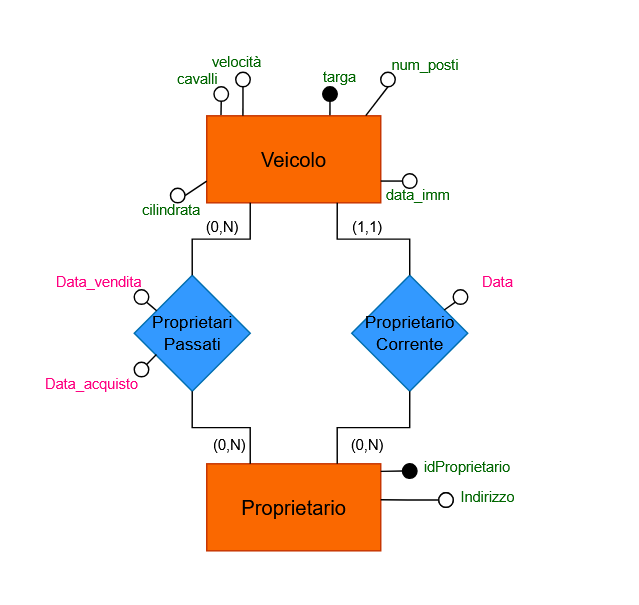

# UNIVERSITÀ DEGLI STUDI DI UDINE
## Dipartimento di Scienze Matematiche, Informatiche e Fisiche


# Relazione Progetto Basi di Dati
### A cura di
- Roland GJOPALAJ	157277     						          
- Giovanni PANTAROTTO	157707					     
- Cristian TOMASS 147813

## Indice degli argomenti
1. [Progettazione Concettuale](#progettazione-concettuale)
2. [Progettazione Logica](#progettazione-logica)
3. [Progettazione Fisica](#progettazione-fisica)
4. [Analisi con R](#analisi-con-r)
5. [Conclusioni](#conclusioni)
# Progettazione Concettuale

## Progetto "Registro Automobilistico"
 Si progetti uno schema entità/relazioni per la gestione di un registro automobilistico, facente parte del sistema informativo di un ufficio di motorizzazione, contenente le seguenti informazioni:
- di ciascun veicolo interessa registrare la targa, la cilindrata, i cavalli fiscali, la velocità, il numero di posti e la data di immatricolazione;
- i veicoli sono classificati in categorie (automobili, ciclomotori, camion, rimorchi, ecc.);
- ciascun veicolo appartiene ad uno specifico modello;
- tra i dati relativi ai veicoli, vi è la codifica del tipo di combustibile utilizzato;
- di ciascun modello di veicolo è registrata la fabbrica di produzione e il numero delle versioni prodotte;
- ciascun veicolo può avere uno o più proprietari, che si succedono nel corso della “vita” del veicolo; di ciascun proprietario interessa registrare cognome, nome e indirizzo di residenza.<br>

Lo schema entità/relazioni dovrà essere completato con attributi "ragionevoli" per ciascuna entità, identificando le possibili chiavi e le relazioni necessarie per la gestione del sistema in esame.
A partire dallo schema entità/relazioni, si costruisca il corrispondente schema relazionale.<br>

### GLOSSARIO Termini
| Termine | Descrione | Sinonimi | Link |
| --- | --- | --- | --- |
| Veicolo| informazioni generali su un veicolo| | Modello, Proprietario, Combustibile|
| Modello| Tipo di modello di veicolo| | Veicolo, Fabbrica|
| Fabbrica| Azienda che procude un modello di veicolo| | Modello|
| Proprietario| Chi ha posseduto e possiede un veicolo| | Veicolo|
| Combustibile| Quale combustibile utilizza un veicolo| | Veicolo|
### Frasi
  **Frasi generiche** :
> Si progetti uno schema entità/relazioni per la gestione di un registro automobilistico, facente parte del sistema informativo di un ufficio di motorizzazione, contenente le seguenti informazioni

**Frasi relative al veicolo**:
> di ciascun veicolo interessa registrare la targa, la cilindrata, i cavalli fiscali, la velocità, il numero di posti e la data di immatricolazione

**Frasi relative al modello**:
> ciascun veicolo appartiene ad uno specifico modello

**Frasi relative alla fabbrica**:
> di ciascun modello di veicolo è registrata la fabbrica di produzione e il numero delle versioni prodotte

**Frasi relative al proprietario**:
> ciascun veicolo possono avere uno o piú proprietari, che si succedono nel corso della “vita” del veicolo; di ciascun proprietario interessa registrare cognome, nome e indirizzo di residenza

**Frasi relative al combustibile**:
> di ciascun veicolo interessa registrare il tipo di combustibile utilizzato

## Modello ER
La strategia che abbiamo utilizzato per costruire il modello ER è la strategia Mista (Mixed Strategy). Abbiamo optato per questa tecnica perché ci sembrava comodo avere uno scheletro iniziale che ci permettesse di avere una visione di base dello schema. Inizialmente abbiamo usato la strategia bottom-up per assemblare insieme tutte le entità. In seguito, abbiamo usato la tecnica top-down, in questo modo, tramite perfezionamenti, abbiamo sviluppato lo schema finale.

La prima entità che abbiamo esaminato è **Veicolo**. Gli attributi che abbiamo aggiunto a questa entità sono targa, cilindrata, cavalli fiscali, velocità, numero di posti e data immatricolazione. Questa entità viene identificata univocamente dall’attributo targa.


In seguito per quanto riguarda Veicolo abbiamo deciso di fare una **generalizzazione** **Totale** e **Disgunta**. In questo modo un veicolo puo` essere distinto tra Automobili, Ciclomotori, Camion e Rimorchio. La generalizzazione e' disgunta perche' veicolo puo' ricoprire solo una delle quattro categorie.

Questo è il modo come abbiamo fatto la generalizzazione insieme ai possibili attributi:

**Veicolo** (Entità genitore):
* **Automobile** (Entità figlia)  
  * tipologia  
* **Camion** (Entità figlia)  
  * numero assi  
* **Ciclomotore** (Entità figlia)  
  * bauletto  
* **Rimorchio** (Entità figlia)  
  * tipologia  
  * carico 


L'entità successiva che abbiamo analizzato è **Modello**. Gli attributi che abbiamo aggiunto a questa entità sono idModello, nome modello e numero versioni. Questa entità viene identificata univocamente dall'attributo idModello.


La prossima entità che abbiamo visto è **Fabbrica**.
A livello conettuale abbiamo gestito fabbrica come il marchio di un modello di veicolo, per esempio: Audi, BMW, Fiat, etc. Gli attributi che abbiamo aggiunto a questa entità sono idFabbrica, nome e numeroVeicoloProdotti. Questa entità viene identificata univocamente dall'attributo idFabbrica. Noi abbiamo scelto "numeroVeicoloProdotti" come l'attributo ridondante che in seguito verifecheremo se si puo' tenere o meno.


L'entità successiva è **Combustibile**. Gli attributi che abbiamo aggiunto a questa entità sono codiceCombustibile e tipoCombustibile. Questa entità viene identificata univocamente dall'attributo codiceCombustibile. TipoCombustibile indica se un veicolo utilizza benzina, diesel, gpl, elettrico e ibrido.


Infine l'ultima entità è **Proprietario**. Gli attributi che abbiamo aggiunto a questa entità sono idProprietario e indirizzo. Questa entità viene identificata univocamente dall'attributo idProprietario. Per comodità abbiamo gestito indirizzo come una unica stringa ma si poteva pensare di utilizzare un attributo composto che rappresentasse la via, il numero civico e la città.


Come aggiunta abbiamo deciso di aggiungere una generalizzazione su proprietario che ci permetta di identificare se è **Privato**, quindi una persona fisica o se appartiene ad una **Società**, quindi un veicolo aziendale. La generalizzazione e' disgunta perche' proprietario puo' ricoprire solo una delle due categorie.

In queste generalizzazione abbiamo pensato di ricavare gli attributi di Privato tramite Proprietario e aggiungere gli attributi di Societa partita iva e nome.
Proprietario (Entità genitore):
* **Privato**  (Entità figlia)  
  * CF: not NULL  
  * nome  not NULL
  * cognome  not NULL
  * data di nascita  
* **Societa** (Entità figlia)  
  * partita iva 


Tra **Modello** e **Veicolo** è presente una relazione uno a molti "**Appartiene**" &rarr; Tra Veicolo (1:1) e Modello (1:N)

* Un veicolo può appartenere solo ad un modello.  
* Più veicoli possono essere dello stesso modello.  
* Per ogni modello deve esserci almeno un veicolo che appartiene a quel modello per essere presente nel database


Tra **Modello** e **Fabbrica** è presente una relazione uno a molti "**Prodotto**" &rarr; Tra Fabbrica (1:1) e Modello (1:N)

* Una fabbrica produce solo un modello.  
* Più fabbriche possono produrre lo stesso modello.  
* Per ogni modello deve esserci almeno una fabbrica che produce quel modello per essere presente nel database


Tra **Veicolo** e **Combustibile** è presente una relazione uno a molti "**Utilizza**" &rarr; Tra Veicolo (1:1) e Combustibile (1:N) 

* Un veicolo utilizza solo un tipo di combustibile.  
* Più veicoli possono utilizzare lo stesso tipo di combustibile.  
* Un tipo di combustibile deve essere utilizzato da almeno un veicolo per poter essere presente nel database


Tra **Veicolo** e **Proprietariosono** presenti due relazioni:
  1) Uno a molti "**Proprietario Corrente**" &rarr; Tra Veicolo (1:1) e Proprietario (0:N) 
 -  Un veicolo appartiene solo un proprietario corrente.  
 - Un proprietario puo' non avere un veicolo al momento oppure avere piu' di uno
 - Data è l'attributo che identifica la data dell'acquisto del veicolo al proprietario corrente
 1) Molti a molti "**Proprietario Passato**" &rarr; Tra Veicolo (0:N) e Proprietario (0:N)
  - Un veicolo puo' avere o no piu' proprietari passati
  - Un proprietario puo' avere o no piu' veicoli nel passato
  - Data acquisto e data vendita sono attributi che identificano la data dell'acquisto e vendita del veicolo al proprietario corrente
  - Se un proprietario compra e vende la stessa macchina due volte allora si registrano solo le date dell’ultima occorrenza. 

"Proprietario Passato" ci risolve la questione della "vita" di un veicolo 
  


## Schema ER finale


## Lista dei Vincoli

### Vincoli di Chiave

##### Chiavi Primarie (PK): Devono essere not null e univoche
- Veicolo.Targa
- Modello.idModello
- Fabbrica.idFabbrica
- Combustibile.codiceCombustibile
- Proprietario.IdProprietario

##### Chiavi Esterne (FK): 
- Veicolo.Modello → Modello.idModello
- Veicolo.CodiceCombustibile → Combustibile.codiceCombustibile
- Veicolo.Proprietario → Proprietario.IdProprietario
- Modello.FabbricaDiProduzione → Fabbrica.idFabbrica
- ProprietariPassati.Targa → Veicolo.Targa
- ProprietariPassati.IdProprietario → Proprietario.IdProprietario


### Vincoli di Entità

(Questi dati sono importanti e devono essere presenti)
- Veicolo.dataImmatricolazione NOT NULL
- Veicolo.dataAquisto NOT NULL
- Veicolo.Cilindrata: NOT NULL  
- Veicolo.Cavalli: NOT NULL  
- Veicolo.Velocita': NOT NULL  
- Veicolo.NumeroPosti: NOT NULL
- Modello.numeroVersioni: NOT NULL
- Proprietario.indirizzo: NOT NULL
- <p>Privato.CF: NOT NULL </p>
- Privato.nome NOT NULL
- Privato.cognome NOT NULL
- Società.partitaIva NOT NULL
- ProprietariPassati.dataAcquisto NOT NULL
- ProprietariPassati.dataVendita NOT NULL


### Vincoli di Dominio

- Modello.numeroVersioni > 0
- Veicolo.cilindrata > 0 (se Rimorchio allora 0)
- Veicolo.cavalli > 0 (se Rimorchio allora 0)
- Veicolo.numeroPosti > 0 (se Rimorchio allora 0)
- Veicolo.velocita' > 0 (se Rimorchio allora 0)


### Vincoli di partecipazione 

+ Affinche' una fabbrica sia presente nel database deve comparire almeno in uno dei modelli presenti
+ Affinche' un modello sia presente nel database deve comparire almeno in uno dei veicoli presenti
+ Affinche un tipo di combustione sia presente nel database deve comparire almeno in uno dei veicoli presenti
+ Un veicolo deve per forza avere un proprietario corrente (uno solo)
+ Un proprietario puo non avere un veicolo al momento


### Vincoli di Generalizzazione
 **Totalità e disgiunzione**
- Ogni proprietario deve essere solo Privato o Società
- Ogni veicolo deve comparire in esattamente una tabella figlia: (Automobile, Camion, Ciclomotore, Rimorchio)


### Vincoli di Integrità Referenziale

- Non posso cancellare nessun oggetto(record) se viene puntato da una chiave esterna
  - esempio: non posso cancellare un proprietario se lui possiede una veicolo che si trova nel database
  - altro esempio: non posso cancellare una fabbrica se esiste un modello che e' stato prodotto da quella fabbrica


### Vincoli di Tupla

- ProprietariPassati: CHECK (dataVendita > dataAcquisto)
- ProprietariPassati: UNIQUE (Targa, IdProprietario)
  - se un proprietario compra e vende piu' di una volta lo stesso veicolo si registra salva solo l'ultima occorrenza

### Vincoli Inter-tabella (Ridondanza Controllata) 

- Trigger per aggiornare Fabbrica.numeroVeicoliProdotti quando viene inserito un nuovo veicolo


### Vincoli generali
  1) La data di acquisto deve essere antecedente rispetto alla data di vendita.  
  2) La data di acquisto deve essere successiva rispetto alla data di immatricolazione.  
  3) La data di vendita deve essere antecedente rispetto alla data di acquisto del veicolo successivo.
  4) La data di acquisto di un proprietario passato deve essere precedente alla data di acquisto del proprietario corrente.
  5) Un proprietario non può vendere un veicolo che non possiede.
  6) Un veicolo non può essere acquistato da un proprietario se è già stato acquistato da un altro proprietario nello stesso giorno.
   
## Regole di Gestione
Di seguito sono elencate le regole di gestione usate nello schema ER.
1) num_veicoli_prodotti: numero di veicoli prodotti dalla fabbrica

Altre idee di regole di gestione che potrebbero essere utilizzate:
1) L'età di un veicolo è la differenza tra la data odierna e la data di immatricolazione.
2) Il numero di anni di proprietà di un veicolo è la differenza tra la data di acquisto e la data di vendita. 

# Progettazione Logica
## Operazioni richeste
- **Op1**: Aggiunta nuovo veicolo prodotto [15 al giorno]
- **Op2**: Calcolare tutti i dati relativi alla fabbrica soprattutto il numero dei veicoli prodotti [2 al giorno]
### Tabella volumi
| Concetto               | Tipo  | Volume   |
|---                     | ---   | ---      |
| Veicolo                | E     | 90000    |
| Proprietario           | E     | 125000   |
| Combustibile           | E     | 5        |
| Modello                | E     | 200      |
| Fabbrica               | E     | 10       |
| ProprietarioCorrente   | R     | 90000    |
| ProprietariPassati     | R     | 225000   |
| Appartiene             | R     | 90000    |
| Prodotto               | R     | 200      |
| Utilizza               | R     | 90000    |

Questa tabella ci fornisce una visione chiara della dimensione del sistema che stiamo progettando. Notiamo che:


* Il rapporto tra veicoli e proprietari è di circa 0.75, indicando che in media una persona possiede meno di un veicolo.  
* Ogni veicolo ha avuto in media 2.5 proprietari nel passato, suggerendo un'alta frequenza di cambi di proprietà.


### Analisi delle ridondanze
**Caso studio: Numero di veicoli prodotti per Fabbrica**

#### Presenza di ridondanza

Consideriamo l'attributo "numeroVeicoliProdotti" nell'entità Fabbrica. Questo è un dato derivabile ma potrebbe essere utile mantenerlo come ridondanza per migliorare le prestazioni.


Per eseguire il calcolo delle operazione in presenza di ridondanze si fa il calcolo di ogni micro processo:

+ OP1: Aggiunta nuovo veicolo (15 volte al giorno):
  + Memorizzo il nuovo veicolo 
  + memorizzo la coppia veicolo-modello 
  + cerco il modello e per risalire alla fabbrica
  + cerca la fabbrica di interesse
  + incremento di uno i veicoli prodotti

|Concetto     |Costrutto|Accessi|Tipo|
|--------     |---------|-------|----|
|Veicolo      | E       |1      |S   |
|Appartiene   |R        |1      |S   |
|Modello      |E        |0      |    |
|Prodotto     |R        |1      |L   |
|Fabbrica     |E        |1      |L   |
|Fabbrica     |E        |1      |S   |


 $(15*3)*2 + (15*2) = 120$

 Totale: 3 scritture \+ 2 letture \= 8 accessi/operazione  
  Costo giornaliero: 8 \* 15 \= 120 accessi


+ OP2: Visualizzazione dati Fabbrica (2 volte al giorno):
  + Leggere gli attributi della fabbrica

|Concetto     |Costrutto|Accessi|Tipo|
|--------     |---------|-------|----|
|Fabbrica     |E        |1      |L   |

 $2*1 = 2$

 Costo giornaliero: 1 \* 2 \= 2 accessi


**Costo totale giornaliero con ridondanza: 122 accessi**


### Assenza di ridondanza


- OP1: Aggiunta nuovo veicolo (15 volte al giorno):
  - Memorizzo il nuovo veicolo
  - Memorizzo la coppia veicolo modello

|Concetto     |Costrutto|Accessi|Tipo|
|--------     |---------|-------|----|
|Veicolo      |E        |1      |S   |
|Appartiene   |R        |1      |S   |
|Modello      |E        |0      |    |
|Prodotto     |R        |0      |    |
|Fabbrica     |E        |0      |    |

 $(15 * 2) * 2 = 60$

Totale: 2 scritture \= 4 accessi/operazione  
  Costo giornaliero: 4 \* 15 \= 60 accessi


- OP2: Visualizzazione dati Fabbrica (2 volte al giorno): 
  - Per calcolare il numero di veicoli prodotti da una fabbrica dobbiamo accedere alla relazione "prodotto" un n di volte pare al numero medio di veicoli prodotti da una certa fabbrica (dalla fabbrica): nrModelli/nrFabbriche (200/10) **e per ogni di questi modelli** bisogna accedere un nr di volte pari al numero medio di veicoli appertenenti ad un modello : nrVeicoli /nrModelli (90000/200)

|Concetto     |Costrutto|Accessi|Tipo|
|--------     |---------|-------|----|
|Fabbrica     |E        |1      |L   | 
|Prodotto     |E        |20     |L   |
|Appartiene   |E        |9000 (20*450)   |L   | 

 $(1+20+9000)*2 = 18042$

 Costo per operazione: 1 \+ 20 \+ 9000 \= 9021 letture  
 Costo giornaliero: 9021 \* 2 \= 18042 accessi

 **Costo totale giornaliero senza ridondanza: 60 \+ 18042 \= 18102 accessi**

### Costi operazione
Presenza di ridondanza &Longrightarrow; $120+2=122$

Assenza di ridondanza &Longrightarrow; $60 + 18042 = 18102$

### **Conclusione dell'analisi**

Mantenere la ridondanza comporta un costo giornaliero di 122 accessi, mentre eliminarla porta a 18102 accessi.  
La differenza è significativa: mantenere la ridondanza riduce il carico di lavoro di circa il 99.3%. Pertanto, è altamente consigliabile mantenere l'attributo ridondante "numeroVeicoliProdotti" nell'entità Fabbrica.


### **Eliminazione delle generalizzazioni**
In questa fase del progetto sono state gestite le generalizzazioni presenti eliminando le gerarchie. In particolare sono state trasformate le seguenti parti:

**Veicolo**


Abbiamo optato per una strategia di accorpamento nel genitore. Questa scelta è motivata dal fatto che la maggior parte delle operazioni coinvolgerà attributi comuni a tutti i tipi di veicolo. 

**Proprietario**


Anche per proprietario abbiamo scelto la stessa strategia.

### Schema ER Finale senza generalizzazioni


### **Partizionamento o accorpamento**

Per quanto riguarda l'entità Proprietario, abbiamo optato per mantenere l'attributo 'indirizzo' come un campo di testo unico, invece di partizionarlo verticalmente in componenti separate (come via, numero civico, CAP, città). Questa decisione è stata presa considerando che l'indirizzo viene generalmente utilizzato come un'unica unità informativa nelle operazioni più frequenti, e la sua scomposizione non offrirebbe vantaggi significativi in termini di prestazioni o funzionalità per il nostro specifico caso d'uso.

### **Selezione degli identificatori**

| Entita`     |  Chiavi          | 
|-------------|-------------------|
| Veicolo     | Targa             | 
| Combustibile| codiceCombustibile | 
| Proprietario| idProprietario      | 
| Modello     | idModello         | 
| Fabbrica    | idFabbrica       | 

La scelta degli identificatori è stata fatta considerando l'unicità, l'immutabilità e la semplicità di gestione.

### Traduzione modello logico


+ fabbrica  {**_id_fabbrica_** (PK), nome, numero_veicolo_prodotti}

+ modello {**_id_modello_** (PK), nome_modello, numero_versioni, **_fabbrica_di_produzione_** (FK → fabbrica._id_fabbrica_)}

+ combustibile {**_codice_combustibile_** (PK), tipo_combustibile}

+ proprietario {**_id_proprietario_** (PK), indirizzo}

+ privato {**_id_proprietario_** (PK, FK → proprietario._id_proprietario_), cf, nome, cognome, data_nascita}

+ societa {**_id_proprietario_** (PK, FK → proprietario._id_proprietario_), partita_iva}

+ veicolo {**_targa_** (PK), cavalli, velocita, numero_posti, data_immatricolazione, cilindrata, data, **_modello_** (FK → modello), **_codice_combustibile_** (FK → combustibile._codice_combustibile_), **_proprietario_** (FK → proprietario._id_proprietario_)}

+ proprietari_passati {**_targa_** (PK, FK → veicolo._targa_), **_id_proprietario_** (PK, FK → proprietario._id_proprietario_), data_vendita, data_acquisto}

+ automobile {**_targa_** (PK, FK → veicolo._targa_), tipologia}

+ ciclomotore {**_targa_** (PK, FK → veicolo._targa_), bauletto}

+ camion {**_targa_** (PK, FK → veicolo._targa_), numero_assi}

+ rimorchio {**_targa_** (PK, FK → veicolo._targa_), tipologia, carico}

**IMPORTANTE:** Le chiavi primarie (PK) e le chiavi esterne (FK) non possono essere NULL


## Progettazione Fisica
### Definizione database in SQL
#### Definizione dati
#### Creazione database
``` sql
CREATE DATABASE registro_automobilistico,
ENCODING 'UTF8',

```
#### Creazione tabelle
```sql
CREATE TABLE fabbrica (
    id_fabbrica INT PRIMARY KEY,
    nome VARCHAR(50) NOT NULL,
    numero_veicoli_prodotti INT DEFAULT 0
);

CREATE TABLE modello (
    id_modello INT PRIMARY KEY,
    nome_modello VARCHAR(50),
    numero_versioni INT NOT NULL CHECK (numero_versioni > 0),
    fabbrica_di_produzione INT NOT NULL,
    FOREIGN KEY (fabbrica_di_produzione) REFERENCES fabbrica(id_fabbrica)
);

CREATE TABLE combustibile (
    codice_combustibile VARCHAR(15) PRIMARY KEY,
    tipo_combustibile VARCHAR(20)
);

CREATE TABLE proprietario (
    id_proprietario INT PRIMARY KEY,
    indirizzo VARCHAR(255) NOT NULL
);

CREATE TABLE privato (
    id_proprietario INT PRIMARY KEY,
    cf VARCHAR(16) NOT NULL UNIQUE,
    nome VARCHAR(50) NOT NULL,
    cognome VARCHAR(50) NOT NULL,
    data_nascita DATE,
    FOREIGN KEY (id_proprietario) REFERENCES proprietario(id_proprietario)
);

CREATE TABLE societa (
    id_proprietario INT PRIMARY KEY,
    partita_iva VARCHAR(16) NOT NULL UNIQUE,
    FOREIGN KEY (id_proprietario) REFERENCES proprietario(id_proprietario)
);

CREATE TABLE veicolo (
    targa VARCHAR(10) PRIMARY KEY,
    cilindrata INT NOT NULL,
    cavalli INT NOT NULL,
    velocita INT NOT NULL,
    numero_posti INT NOT NULL,
    data_immatricolazione DATE NOT NULL,
    data DATE NOT NULL,
    modello INT NOT NULL,
    codice_combustibile VARCHAR(15) NOT NULL,
    proprietario INT NOT NULL,
    CHECK (
        (cilindrata >= 0) AND 
        (cavalli >= 0) AND 
        (velocita >= 0) AND 
        (numero_posti >= 0)
    ),
    FOREIGN KEY (modello) REFERENCES modello(id_modello),
    FOREIGN KEY (codice_combustibile) REFERENCES combustibile(codice_combustibile),
    FOREIGN KEY (proprietario) REFERENCES proprietario(id_proprietario)
);

CREATE TABLE automobile (
    targa VARCHAR(10) PRIMARY KEY,
    tipologia VARCHAR(20),
    FOREIGN KEY (targa) REFERENCES veicolo(targa)
);

CREATE TABLE ciclomotore (
    targa VARCHAR(10) PRIMARY KEY,
    bauletto BOOLEAN,
    FOREIGN KEY (targa) REFERENCES veicolo(targa)
);

CREATE TABLE camion (
    targa VARCHAR(10) PRIMARY KEY,
    numero_assi INT,
    FOREIGN KEY (targa) REFERENCES veicolo(targa)
);

CREATE TABLE rimorchio (
    targa VARCHAR(10) PRIMARY KEY,
    tipologia VARCHAR(20),
    carico INT,
    FOREIGN KEY (targa) REFERENCES veicolo(targa)
);

CREATE TABLE proprietari_passati (
    targa VARCHAR(10),
    id_proprietario INT,
    data_acquisto DATE NOT NULL,
    data_vendita DATE NOT NULL,
    PRIMARY KEY (targa, id_proprietario),
    CHECK (data_vendita > data_acquisto),
    FOREIGN KEY (targa) REFERENCES veicolo(targa),
    FOREIGN KEY (id_proprietario) REFERENCES proprietario(id_proprietario)
);
```
#### Definizione trigger
```sql
-- Trigger --
--controllo nr_veicoli_prodotti--
CREATE OR REPLACE FUNCTION aggiorna_conteggio_veicoli() 
RETURNS TRIGGER AS $$
BEGIN
    UPDATE fabbrica
    SET numero_veicoli_prodotti = numero_veicoli_prodotti + 1
    WHERE id_fabbrica = (
        SELECT fabbrica_di_produzione 
        FROM modello 
        WHERE id_modello = NEW.modello
    );
    RETURN NEW;
END;
$$ LANGUAGE plpgsql;

CREATE TRIGGER trigger_conteggio_veicoli
AFTER INSERT ON veicolo
FOR EACH ROW EXECUTE FUNCTION aggiorna_conteggio_veicoli();

-------------------------------------------------------------------------------
-- Trigger per verificare mutua esclusione PRIVATO
CREATE OR REPLACE FUNCTION check_privato_mutua_esclusione()
RETURNS TRIGGER AS $$
BEGIN
    -- Verifica se esiste già in societa
    IF EXISTS (SELECT 1 FROM societa WHERE id_proprietario = NEW.id_proprietario) THEN
        RAISE EXCEPTION 'Mutua esclusione violata: ID % è già registrato come società', NEW.id_proprietario;
    END IF;
    RETURN NEW;
END;
$$ LANGUAGE plpgsql;

CREATE TRIGGER trigger_check_privato
BEFORE INSERT OR UPDATE ON privato
FOR EACH ROW EXECUTE FUNCTION check_privato_mutua_esclusione();

-- Trigger per verificare mutua esclusione SOCIETA
CREATE OR REPLACE FUNCTION check_societa_mutua_esclusione()
RETURNS TRIGGER AS $$
BEGIN
    -- Verifica se esiste già in privato
    IF EXISTS (SELECT 1 FROM privato WHERE id_proprietario = NEW.id_proprietario) THEN
        RAISE EXCEPTION 'Mutua esclusione violata: ID % è già registrato come privato', NEW.id_proprietario;
    END IF;
    RETURN NEW;
END;
$$ LANGUAGE plpgsql;

CREATE TRIGGER trigger_check_societa
BEFORE INSERT OR UPDATE ON societa
FOR EACH ROW EXECUTE FUNCTION check_societa_mutua_esclusione();
```
### Popolazione base di dati
### Query
1. I veicoli con almeno 1 proprietario
```sql
SELECT v.targa
FROM veicolo as v
WHERE not exists(
  SELECT *
  FROM veicolo as v1
  WHERE v1.targa <> v.targa and
  v1.proprietario = v.proprietario
  )
```
2. Il veicolo con il maggior numero di cavalli che ha avuto 1 e un solo proprietario.
```sql
create view maxCavalli(targa,nCavalli) as
  select v.targa,count(*)
  from veicolo as v
  group by v.cavalli

  select mc.targa
  from veicolo as v1, maxCavalli as mc
  where v1.propritario proprietario mc.nCavalli >= ALL (
    select mc1.nCavalli
    from maxCavalli AS mc1
    where mc1.nCavalli <> mc.nCavalli
```
3. Le societ&agrave; che è un proprietario passato di esattamente 2 veicoli
```sql
```

4. Tutti i veicoli prodotti da fabbriche che hanno prodotto esattamente 3 modelli.
```sql
SELECT V.Targa
FROM Veicolo V
WHERE V.Modello = M.idModello
AND M.FabbricaDiProduzione = F.idFabbrica
AND F.idFabbrica IN (
    SELECT F2.idFabbrica
    FROM Fabbrica F2
    JOIN Modello M2 ON F2.idFabbrica = M2.FabbricaDiProduzione
    GROUP BY F2.idFabbrica
    HAVING COUNT(DISTINCT M2.idModello) = 3
);
```
``` sql
SELECT V.Targa
FROM Veicolo V
JOIN Modello M ON V.Modello = M.idModello
JOIN Fabbrica F ON M.FabbricaDiProduzione = F.idFabbrica
WHERE F.idFabbrica IN (
    SELECT F2.idFabbrica
    FROM Fabbrica F2
    WHERE EXISTS (
        SELECT *
        FROM Modello M2
        WHERE M2.FabbricaDiProduzione = F2.idFabbrica
        AND EXISTS (
            SELECT *
            FROM Modello M3
            WHERE M3.FabbricaDiProduzione = F2.idFabbrica
            AND M3.idModello <> M2.idModello
            AND EXISTS (
                SELECT *
                FROM Modello M4
                WHERE M4.FabbricaDiProduzione = F2.idFabbrica
                AND M4.idModello <> M2.idModello
                AND M4.idModello <> M3.idModello
                AND NOT EXISTS (
                    SELECT *
                    FROM Modello M5
                    WHERE M5.FabbricaDiProduzione = F2.idFabbrica
                    AND M5.idModello <> M2.idModello
                    AND M5.idModello <> M3.idModello
                    AND M5.idModello <> M4.idModello
                )
            )
        )
    )
);
```

5. Tutti i veicoli in cui il proprietario corrente è anche un proprietario passato
```sql
SELECT v.targa
FROM veicolo as v
WHERE NOT EXISTS(
  SELECT *
  FROM proprietariPassati as p1
  WHERE v.proprietario <> p1.codiceFiscale and
  v.targa = p1.targa)
```
6. La fabbrica con il massimo numero di veicoli elettrici.
```sql
CREATE VIEW maxElet(targa,codiceCombustibile,nVeicoli) AS (  
  SELECT v1.targa,v1.codiceCombustibile,count(*)
  FROM veicolo AS V1
  GROUP BY V1.codiceCombustibile
  )

SELECT targa
FROM maxElet AS ME
WHERE ME.codiceCombustibile = "Elettrico" AND
ME.nVeicoli >= ALL(
  SELECT ME1.nVeicoli
  FROM maxElet
  )
```
## Analisi con R
## Conclusioni


